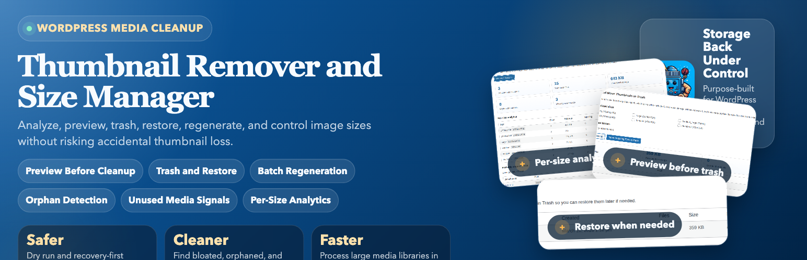
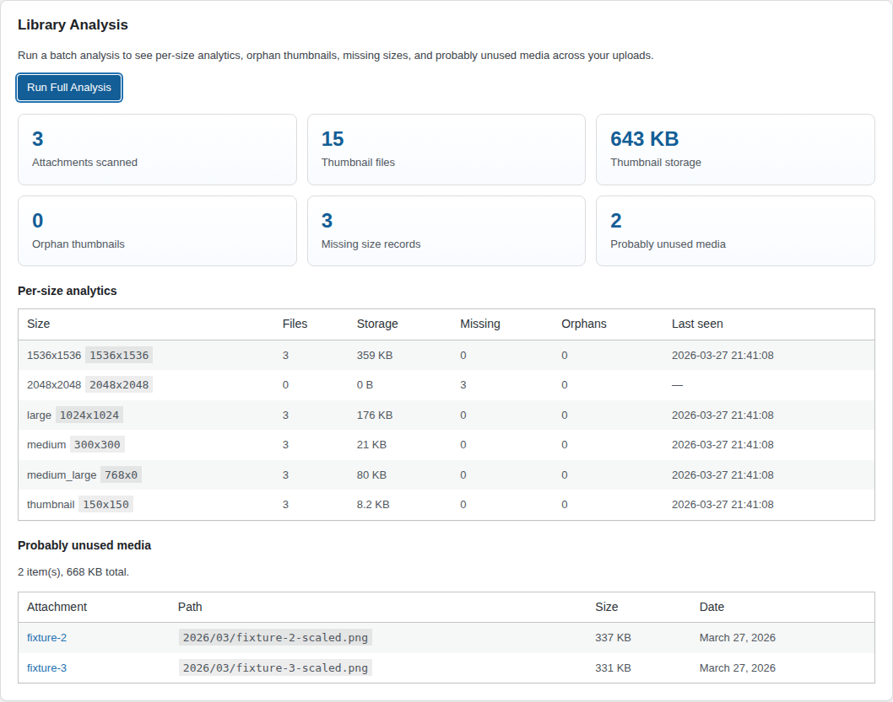
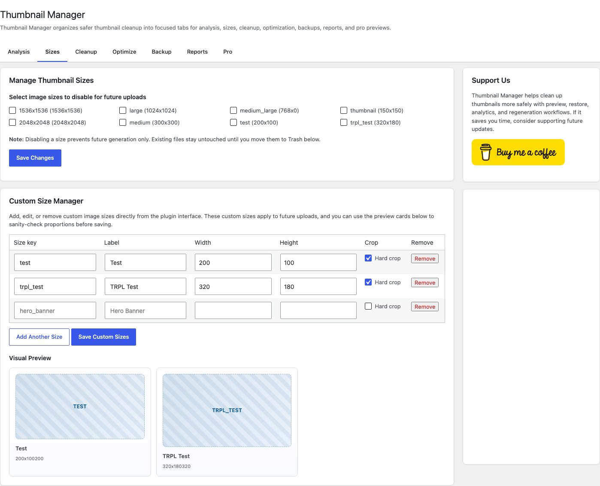
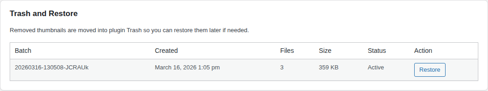
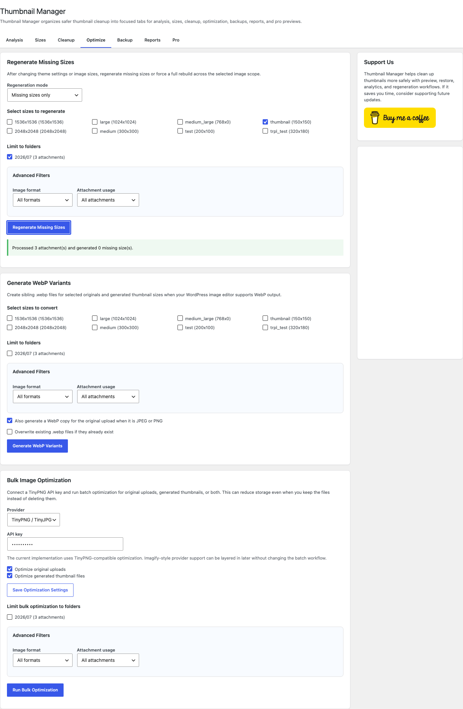

# Thumbnail Remover and Size Manager

**Contributors:** mehdiraized  
**Tags:** thumbnails, media management, image optimization, cleanup, regenerate thumbnails  
**Requires at least:** 5.0  
**Tested up to:** 6.9  
**Stable tag:** 2.2.4  
**Requires PHP:** 7.4  
**License:** GPLv2 or later  
**License URI:** https://www.gnu.org/licenses/gpl-2.0.html

Safely analyze, preview, trash, restore, schedule, regenerate, report on, and manage WordPress thumbnails and image sizes.

Landing page: [https://mehdiraized.github.io/thumbnail-remover/](https://mehdiraized.github.io/thumbnail-remover/)

WordPress.org: [https://wordpress.org/plugins/thumbnail-remover/](https://wordpress.org/plugins/thumbnail-remover/)

## Overview

Thumbnail Remover and Size Manager 2.2 continues the plugin's safer media maintenance workflow for WordPress sites.

Instead of removing thumbnails with a single irreversible step, the current release adds:

- Dry-run preview before cleanup
- Trash and Restore workflow
- Batch processing with progress
- Unused media detection
- Orphan thumbnail detection
- Missing-size regeneration
- Per-size analytics
- Reporting and recent activity logs
- Advanced filters for format, usage status, and orphan-only cleanup
- WebP variant generation for JPEG and PNG uploads
- Media Library thumbnail summary column with per-image quick actions
- Custom image size manager with visual previews
- Bulk image optimization with TinyPNG-compatible API support
- Size usage analysis based on content and stored meta references
- Existing image-size disable controls
- Zip backups for uploads and cleanup batches
- Scheduled cleanup with configurable frequency and scope

## Main Features

### Dry Run / Preview

Preview cleanup before acting. The plugin shows:

- How many files match your filters
- How much storage will be recovered
- Which sizes are involved
- How many orphan thumbnails were detected

### Trash / Restore

Matching thumbnails are moved into plugin Trash instead of being deleted permanently. You can restore a trash batch later from the same admin screen.

When you are ready to free disk space, use `Delete Permanently` for one trash batch or `Empty Trash` for all batches.

Cleanup can also create a zip backup of the exact matching thumbnails before they are moved, and the backup remains downloadable from the Trash batch table.

### Batch Processing

Large scans, cleanup jobs, and regeneration jobs run in batches and report progress in the interface to reduce timeout problems on larger sites.

### Scheduled Cleanup

Use the scheduled cleanup section to let WP-Cron move matching thumbnail files into plugin Trash automatically on a daily, weekly, or monthly cadence. You can scope scheduled runs to specific registered sizes and upload folders, and scheduled deletions remain restorable through the same Trash batches used by manual cleanup.

### Unused Media Detection

The analysis screen flags attachments that appear unused based on:

- Featured image relationships
- Parent attachment relationships
- Post/page content references
- Stored post meta / common builder content references

These results should be reviewed manually before any broader media cleanup decisions.

### Orphan Thumbnail Detection

The plugin detects on-disk thumbnail files that are no longer tracked in WordPress attachment metadata.

### Regenerate Missing Sizes

If you keep or re-enable image sizes, you can regenerate missing derivatives in batch mode or force a full rebuild for selected sizes. Media Library bulk actions also let you regenerate selected images directly from the list screen.

### Per-Size Analytics

See per-size analytics including:

- File count
- Reference counts found in site content
- Total storage used
- Missing size count
- Orphan count
- Last seen attachment date

### Advanced Filtering

Narrow analysis, cleanup, and regeneration jobs with extra filters for:

- Original image format such as JPEG, PNG, GIF, WebP, or AVIF
- Attachment usage status, including probably unused attachments only
- Thumbnail source, so you can isolate orphan files or metadata-tracked sizes before moving anything to Trash

### Reporting and Logs

Review recent media operations from the admin screen, including analysis runs, previews, cleanup batches, restores, regenerations, backups, and WP-Cron cleanup activity. The reporting view also summarizes recovered storage, regenerated sizes, restore totals, and backup runs.

### WebP Support

Generate sibling `.webp` files for selected original uploads and registered thumbnail sizes in batch mode. Existing files can be skipped or overwritten, and each run is recorded in the activity log.

### Bulk Image Optimization

Connect a TinyPNG API key and optimize original uploads, generated thumbnails, or both in batch mode. The optimization workflow reuses the plugin's folder scoping and advanced filters so you can target only the parts of the library you actually want to shrink.

## Installation

1. Upload the plugin files to `/wp-content/plugins/thumbnail-remover`, or install it through the WordPress plugins screen.
2. Activate the plugin.
3. Open `Tools > Thumbnail Manager`.
4. Run a full analysis before your first cleanup.
5. Configure scheduled cleanup if you want recurring maintenance.

## Recommended Workflow

1. Run **Full Analysis**
2. Review per-size analytics, orphan counts, and probably unused media
3. Keep the cleanup backup option enabled, or create a broader uploads backup if needed
4. Use **Preview Cleanup**
5. Move matching thumbnails to **Trash**
6. Restore a batch if you need to reverse the cleanup
7. Regenerate missing sizes after re-enabling any image sizes

## FAQ

### Does the plugin permanently delete thumbnails?

Not during cleanup. Version 2 moves matching thumbnail files into plugin Trash first, so you can restore a cleanup batch later if needed. To free disk space permanently, use `Delete Permanently` for one batch or `Empty Trash` for all batches in the Trash and Restore table.

### What does Preview Cleanup show before I remove anything?

Preview Cleanup runs a dry run and shows how many files match your current filters, which sizes are included, how much storage can be recovered, and how many orphan thumbnails were found.

### What are orphan thumbnails?

Orphan thumbnails are resized image files that still exist on disk but are no longer tracked in WordPress attachment metadata. The plugin can detect them during analysis and include them in preview and cleanup results.

### How does unused media detection work?

The plugin checks whether attachments appear to be used in featured images, parent attachment relationships, post or page content, and stored builder or meta content. These results are meant as "probably unused" signals and should still be reviewed manually.

### Can I disable image sizes for future uploads without touching old files?

Yes. You can disable selected registered image sizes for future uploads. This only stops new thumbnails from being generated. Existing files remain untouched until you preview and move them to Trash yourself.

### Can I regenerate missing sizes after re-enabling a size?

Yes. The regeneration tool can rebuild missing image sizes in batches, which is useful after re-enabling sizes or cleaning up incomplete media libraries.

### Can the plugin generate WebP copies for my existing media?

Yes. The WebP generation tool can create `.webp` copies for JPEG and PNG originals plus their registered thumbnail sizes when your WordPress image editor supports WebP output.

### Can I filter cleanup jobs to only orphan thumbnails or probably unused media?

Yes. The advanced filters let you limit analysis, cleanup, and regeneration to specific image formats, usage status, and orphan-versus-tracked thumbnail sources.

### Is the plugin safe for larger media libraries?

It is designed to be safer on larger sites than one-click cleanup tools. Analysis, cleanup, and regeneration run in batches and show progress in the admin UI to reduce timeout issues.

### Can I back up uploads before cleanup?

Yes. Cleanup can create a zip backup of the exact matching thumbnails before moving them to Trash. You can also create a broader zip backup for all uploads or only a selected year/month uploads folder before making cleanup changes.

### Can I restore only one cleanup batch?

Yes. Each cleanup run is stored as its own Trash batch, so you can restore a specific batch without undoing every previous cleanup action.

### How do I empty the plugin Trash?

Use `Empty Trash` in the Trash and Restore table to remove every batch, or use `Delete Permanently` for a single batch. This deletes the stored trash files and any backup stored with those batches, and it cannot be undone.

### Does scheduled cleanup delete files permanently?

No. Scheduled cleanup also moves matching files into plugin Trash first. The main difference is that the job is created by WP-Cron instead of a manual button click.

## Screenshots

### Library Analysis

### Preview and Move Thumbnails to Trash

### Trash and Restore

### Regenerate Missing Sizes

## Changelog

### Unreleased

- Added a Media Library column showing thumbnail totals, storage, orphan counts, and missing-size hints per image
- Added Media Library quick actions to move one image's thumbnails to Trash or regenerate missing sizes
- Added a custom size manager for registering, editing, and removing custom image sizes with visual previews
- Added TinyPNG-compatible bulk optimization for originals and generated thumbnails
- Added size-usage analysis so the analytics table reports which thumbnail sizes appear in content and meta references
- Expanded thumbnail regeneration with missing-only vs full rebuild modes and Media Library bulk actions
- Added batch WebP generation for JPEG and PNG originals plus registered thumbnail sizes
- Added WebP generation controls for include-original and overwrite-existing behavior
- Logged WebP generation runs in the Reporting and Logs section
- Added optional zip backups for matching thumbnails before they are moved to plugin Trash
- Stored cleanup backup links with Trash batches so previous cleanup backups remain downloadable
- Added advanced filters for image format, attachment usage, and orphan-only versus tracked thumbnail cleanup
- Reused the same filters across analysis, preview cleanup, and regeneration workflows
- Updated the admin UI and docs to explain the new filtering options

### 2.2.0

- Added a Reporting and Logs section with recent activity history
- Added operation summaries for recovered storage, restores, regenerated sizes, and backups
- Logged manual and scheduled cleanup activity, preview runs, analysis runs, restores, regenerations, and backup events

### 2.1.0

- Added WP-Cron scheduled cleanup with daily, weekly, and monthly frequency options
- Added scheduled cleanup scope controls for image sizes and upload folders
- Added scheduled cleanup run status, next-run visibility, and last-result summaries in the admin UI
- Kept scheduled cleanup on the same Trash-and-Restore workflow as manual cleanup

### 2.0.0

- Added dry-run preview before cleanup
- Added Trash and Restore workflow
- Added batch processing with progress for analysis, cleanup, and regeneration
- Added orphan thumbnail detection
- Added probably unused media detection
- Added missing-size regeneration
- Added per-size analytics dashboard
- Refreshed the admin UI and plugin descriptions

### 1.1.5

- Fixed a fatal error when disabling thumbnail sizes on PHP 8.x
- Hardened settings and AJAX input handling for string-based values
- Updated compatibility metadata for the latest WordPress release

## Release Workflow

- Run `npm install` once so Husky installs the local git hooks.
- The first push to `main` now prepares a local release commit such as `chore(release): v2.2.1` and stops the push so you can review it.
- Re-run `git push origin main` after that release commit is created. The second push syncs the exact same version to the local WordPress.org SVN checkout before GitHub push completes.
- GitHub Actions now only validates the plugin, creates the Git tag and GitHub release for the version already prepared locally, generates release notes from commit messages, and deploys the docs site.
- To skip the local WordPress.org deploy for one push, use `TRPL_SKIP_WPORG_DEPLOY=1 git push origin main`.

## Screenshot Workflow

- CI screenshot generation is disabled.
- Refresh the plugin screenshots locally with `npm run screenshots`.
- If the local WordPress test environment is already prepared, capture only the images with `npm run screenshots:capture`.

## Support

If the plugin saves you time, you can support future development here:

[Buy Me a Coffee](https://www.buymeacoffee.com/mehdiraized)
### Custom Size Manager

Create, update, and remove custom image sizes from the plugin screen. The manager includes a simple visual preview so you can sanity-check new dimensions before you save them for future uploads.
